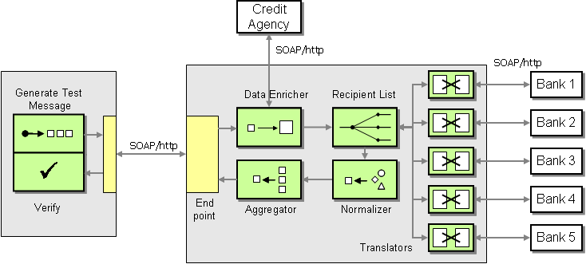

# Loan Broker

Sample application using REST Web Services



Credits:
[Enterprise Integration Patterns](https://www.enterpriseintegrationpatterns.com/patterns/messaging/ComposedMessagingWS.html)

## Getting Started

### Requirements

- [Docker Desktop](https://www.docker.com/products/docker-desktop)
- [Docker Compose](https://docs.docker.com/compose/install/)

Then close the repository and start the web servers:

```sh
git clone https://github.com/mickaelpham/loan-apps-ws
cd loan-apps-ws
docker-compose up
```

### Usage

Try to send some requests to `/loan-request`, e.g.:

```sh
curl --request POST \
  --url http://localhost:4567/loan-request \
  --header 'Content-Type: application/json' \
  --data '{
	"name": "Mickaël Pham",
	"ssn": "345678912",
	"amount": 501
}'
```

The list of SSN <=> Credit Score is located in `credit-bureau/app.rb`

```rb
CREDIT_SCORES_DB = {
  '123456789' => 824,
  '234567891' => 542,
  '345678912' => 738,
  '456789123' => 434
}.freeze
```

You can use a variant of any SSN, or amount, and you should get a response from
one or the other bank as the best quote.

## Solution Architecture

### Data Enricher

Located in `loan-broker/app.rb`, the content enricher queries the
`credit-bureau` service to retrieve a credit score based of the Social Security
Number in the loan request.

### Recipient List

The lender list in `loan-broker/lender_list.rb` contains a mapping of credit
score (as a ceiling) to a list of banks to submit the application to.

### Gateways

Each bank has a separate gateway, because their HTTP API are slightly different.

### Normalizer

Each gateway returns a `Hash` (Ruby) containing the following keys:

| key             | description                                                |
| --------------- | ---------------------------------------------------------- |
| `bank`          | The name of the bank that is issuing the loan              |
| `interest_rate` | The interest rate as a float number (`0.1` == 10%)         |
| `amount`        | The requested amount in USD                                |
| `approved`      | A boolean flag indicating if the approved the loan request |

### Aggregator

We use an
[interactor](https://goiabada.blog/interactors-in-ruby-easy-as-cake-simple-as-pie-33f66de2eb78)
in `loan-broker/best_quote.rb` to query all the bank from the `LenderList`
synchronously, then we filter down to retain only the approved loan requests,
and we select the one with the lowest interest rate
